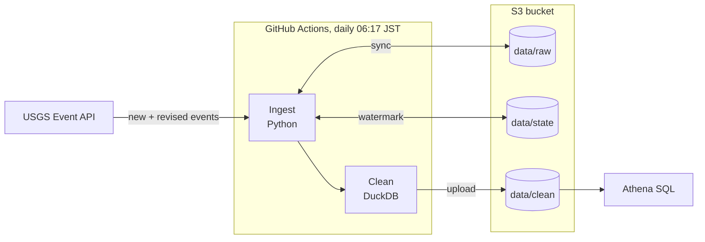

# quake-pipeline

[](https://github.com/grbohanec/quake-pipeline/actions/workflows/ci.yml)
[](https://github.com/grbohanec/quake-pipeline/actions/workflows/daily-refresh.yml)

An automated data pipeline that pulls every M2.0+ earthquake since 1880 from the [USGS Earthquake API](https://earthquake.usgs.gov/fdsnws/event/1/) (about 1.55 million events), cleans it into partitioned Parquet on S3, and refreshes itself every morning. The full history is queryable with SQL in Amazon Athena, for a few cents a month.

This is the rebuilt version of my [Earthquake Severity Prediction Project](https://github.com/grbohanec/Earthquake-Severity-Prediction-Project). That was a one-time Spark notebook on 51 hand-downloaded CSVs that stopped at June 2024; this one ingests automatically and stays current.

## Architecture



1. **Ingest** asks USGS only for events added or revised since the last run, and saves them untouched to the raw layer.
2. **Clean** rebuilds a typed, de-duplicated, validated dataset from raw, partitioned by year.
3. **Athena** queries the clean Parquet files in place.

## Example

Strongest earthquakes near Japan in the last 10 years:

```sql
SELECT event_time AT TIME ZONE 'Asia/Tokyo' AS time_jst, mag, depth_km, place
FROM quakes.usgs_events
WHERE year >= year(current_date) - 10
  AND latitude BETWEEN 24 AND 46
  AND longitude BETWEEN 122 AND 146
ORDER BY mag DESC
LIMIT 5;
```

A per-year count over the whole dataset scans about 1 MB, because Parquet lets Athena read only the columns a query uses. More queries are in [`sql/athena/example_queries.sql`](sql/athena/example_queries.sql).

## Quickstart

Requires Python 3.10 or newer.

```bash
git clone https://github.com/grbohanec/quake-pipeline
cd quake-pipeline
python -m venv .venv
source .venv/bin/activate        # Windows: .venv\Scripts\activate
pip install -e ".[dev]"
pytest
```

Pull a month of data, then build the clean layer:

```bash
quake-ingest-usgs --backfill --start 2026-09-01
quake-clean
```

Data is written to `data/` (git-ignored).

## Usage

### Ingest

| Command | What it does |
| --- | --- |
| `quake-ingest-usgs --backfill --start 1880-01-01` | Pulls every event in a date range. Safe to interrupt: re-running resumes where it stopped. |
| `quake-ingest-usgs --incremental` | Pulls only events new or revised since the last run. |

Options: `--min-mag` (default 2.0), `--lookback-days` (default 30), `--data-dir` (default `data/`), `--restart` (ignore saved backfill progress).

### Clean

```bash
quake-clean
```

Reads every raw file and writes `data/clean/usgs/year=YYYY/`:

- **Types:** text becomes timestamps and numbers; blanks become nulls, not zeros.
- **One row per earthquake:** overlapping downloads and USGS revisions collapse to the newest version of each event.
- **Validation:** rows missing a time, location or magnitude, or with impossible values, are dropped and counted.
- **Safe rebuilds:** built in a temporary folder and swapped in only when complete.

## How it works

- **The 20,000-event limit.** USGS returns at most 20,000 events per request. The ingester asks the `/count` endpoint first and halves date ranges until each piece fits. Long backfills start as one-year chunks, and timeouts trigger more splitting.
- **Raw layer.** Each response is saved as-is under `data/raw/usgs/run_id=<timestamp>/`, every column kept as text, so cleaning can always be re-run from the original data.
- **Incremental loads.** USGS revises events after they happen. The latest `updated` timestamp seen is stored in `data/state/usgs.json` as a watermark, and the next run asks only for events updated after it.
- **Reliability.** Rate limits and server errors are retried with backoff. Progress is saved after every chunk and files are written atomically, so any run can be safely repeated.

## Deployment (AWS + GitHub Actions)

[`daily-refresh.yml`](.github/workflows/daily-refresh.yml) runs every day at 06:17 Tokyo time, and on demand from the Actions tab. It downloads `data/raw` and `data/state` from S3, runs an incremental ingest, rebuilds the clean layer and syncs everything back.

**Authentication** uses one of:

- **GitHub OIDC (preferred):** set the repository variable `AWS_ROLE_ARN` to an IAM role that trusts GitHub's OIDC provider. No keys are stored.
- **Access key (current setup):** secrets `AWS_ACCESS_KEY_ID` and `AWS_SECRET_ACCESS_KEY` for an IAM user whose only permission is `s3://<bucket>/data/*`. This project uses it because its AWS account type blocks creating OIDC providers.

The bucket and region default to `gabe-quake-pipeline` and `us-east-2`; override them with repository variables `S3_BUCKET` and `AWS_REGION`.

**Athena:** run [`sql/athena/create_tables.sql`](sql/athena/create_tables.sql) once. It uses partition projection, so new years appear automatically with no Glue crawler.

## Design decisions

| Decision | Why |
| --- | --- |
| DuckDB, not Spark | ~1.5M rows (~100 MB) clean in seconds on one machine; a cluster would take longer to start than the job takes to run. |
| Raw + clean layers | Cleaning logic can change or be fixed and re-run without re-downloading 146 years of data. |
| Full rebuild of the clean layer | Seconds at this size and always correct. At scale: Iceberg or Delta Lake with `MERGE`. |
| Partition by year, not month | Early decades have few events; monthly folders would create thousands of tiny files. |
| GitHub Actions, not Airflow | One daily job doesn't justify an orchestrator. |
| Timestamps in UTC | Converted only for display, avoiding time-zone bugs. |

## Project layout

```
src/quake_pipeline/
  ingest/usgs.py          USGS API -> raw layer
  transform/clean.py      raw layer -> clean layer
tests/                    unit tests, mirroring src/ (offline, fake USGS API)
sql/athena/               table definition and example queries
.github/workflows/
  ci.yml                  lint + tests on every push
  daily-refresh.yml       scheduled pipeline run
```

## Roadmap

- [x] USGS ingestion: backfill and incremental, M2.0+
- [x] Clean layer: typed, de-duplicated, validated, partitioned
- [x] Daily refresh on GitHub Actions, stored in S3, queryable in Athena
- [ ] Data quality checks and failure alerts
- [ ] JMA source for small earthquakes in Japan
- [ ] Severity model rebuilt on the clean layer
- [ ] Dashboard

## License

[MIT](LICENSE)
